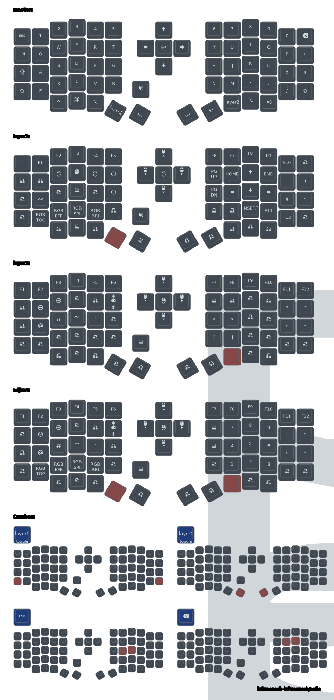

This is my personal [ZMK firmware](https://github.com/zmkfirmware/zmk/) configuration for my [sofle](https://github.com/josefadamcik/SofleKeyboard) keyboard.

# Current Layout Setup



# Building the firmware

Currently the only way to build the firmware needed is through nix using the provided `firmware` package

```nix
nix build .#firmware
```

This will generate two `uf2` (`zmk_left.uf2` & `zmk_right.uf2`) that needs to be copied on the left & right side of the keyboard

<details>
<summary>Building through github action (Currently disabled)</summary>

Place the content of this snippet into `.github/workflows/build.yml`

```yaml
name: Build ZMK firmware
on:
  workflow_dispatch:
  push:
    paths-ignore:
      - "layout/**"
jobs:
  build:
    uses: zmkfirmware/zmk/.github/workflows/build-user-config.yml@main
```

</details>

# ZMK Cheat Sheet

## [Modifiers Functions](https://zmk.dev/docs/codes/modifiers)

`xx(code)` adds modifier key to the `code`.
They can be combined. `&kp LC(RA(B))` = <kbd>Ctrl</kbd>+<kbd>Alt</kbd>+<kbd>b</kbd>.

Modifier functions

- `LS(code)` : Left Shift
- `RS(code)` : Right Shift
- `LC(code)` : Left Control
- `RC(code)` : Right Control
- `LA(code)` : Left Alt
- `RA(code)` : Right Alt
- `LG(code)` : Left GUI (Windows / Command / Meta)
- `RG(code)` : Right GUI (Windows / Command / Meta)

## Behaviors

- [Key Press](https://zmk.dev/docs/behaviors/key-press) (`&kp key`) &#8594; press the `key`
- [Momentary layer](https://zmk.dev/docs/behaviors/layers#momentary-layer) (`&mo layer`) &#8594; momentary activate specified `layer`.
- [Transparent](https://zmk.dev/docs/behaviors/misc#transparent) (`&trans`) &#8594; Pass down to the next active layer in the stack.
- [None](https://zmk.dev/docs/behaviors/misc#none) (`&none`) &#8594; No behavior.
- [Caps Word Behavior](https://zmk.dev/docs/behaviors/caps-word) (`&caps_word`) &#8594; Capitalize till stop key pressed. stop key is not alphabet and `continue-list`. (More infos [here](https://zmk.dev/docs/config/behaviors#caps-word))
- [To Layer](https://zmk.dev/docs/behaviors/layers#to-layer) (`&to layer`) &#8594; Enable the `layer` and the default layer, and disable all other layers. (maybe it for &trans behavior).
- [Toggle Layer](https://zmk.dev/docs/behaviors/layers#toggle-layer) (`&tog layer`) &#8594; Enable the `layer` until the `layer` is disabled.
- [Key Toggle](https://zmk.dev/docs/behaviors/key-toggle) (`&kt key`) &#8594; toggle the `key` hold or released.
- [Sticky Key](https://zmk.dev/docs/behaviors/sticky-key) (`&sk key`) &#8594; Stick the `key` till next key pressed. (More infos [here](https://zmk.dev/docs/config/behaviors#sticky-key))
- [Sticky Layer](https://zmk.dev/docs/behaviors/sticky-layer) (`&sl layer`) &#8594; Stick the `layer` till next key pressed.
- [Key Repeat Behavior](https://zmk.dev/docs/behaviors/key-repeat) (`&key_repeat`) &#8594; Repeats the last key. (More infos [here](https://zmk.dev/docs/config/behaviors#key-repeat))
- [Hold-Tap Behavior](https://zmk.dev/docs/behaviors/hold-tap) &#8594; released within `tapping-term-ms`, sends tap key. hold after the time, sends (holds) the hold key. (More infos [here](https://zmk.dev/docs/config/behaviors#hold-tap))

  ```c
      behaviors {
          key: name {
              compatible = "zmk,behavior-hold-tap";
              label = "LABEL";
              #binding-cells = <2>;
              tapping-term-ms = <200>;
              quick-tap-ms = <0>;
              flavor = "flavor"; // hold-preferred, balanced, tap-preferred, tap-unless-interrupted
              bindings = <hold>, <tap>; // behavior like <&kp>, <&mo>
          };
      };
  ```

  

- [Mod-Tap Behavior](https://zmk.dev/docs/behaviors/mod-tap) (`&mt modkey tapkey`) &#8594; hold to send `modkey`, tap to send `tapkey`.
  This behavior equals the Hold-tap "hold-preferred" with (`hold` = key press(`&kp`), `tap` = key press(`&kp`)).

  ```c
      behaviors {
          mt_impl: mod-tap-by-hold-tap {
              compatible = "zmk,behavior-hold-tap";
              label = "MOD_TAP_BY_HOLD_TAP";
              #binding-cells = <2>;
              tapping-term-ms = <200>;
              quick-tap-ms = <0>;
              flavor = "hold-preferred";
              bindings = <&kp>, <&kp>;
          };
      };

      // &mt modkey tapkey = &mt_impl modkey tapkey
  ```

- [Layer-tap](https://zmk.dev/docs/behaviors/layers#layer-tap) (`&lt layer key`) &#8594; tap sends the `key`, holds activate the `layer`.
  This behavior equals the Hold-tap "tap-preferred" with (`hold` = momentary layer(`&mo`), `tap` = key press(`&kp`)).

  ```c
      behaviors {
          lt_impl: layer-tap-by-hold-tap {
              compatible = "zmk,behavior-hold-tap";
              label = "LAYER_TAP_BY_HOLD_TAP";
              #binding-cells = <2>;
              tapping-term-ms = <200>;
              quick-tap-ms = <0>;
              flavor = "tap-preferred";
              bindings = <&mo>, <&kp>;
          };
      };

      // &lt layer key = &lt_impl layer key
  ```

- [Conditional Layers](https://zmk.dev/docs/features/conditional-layers) &#8594; If some multiple layers are enabled (in above example, `1` and `2`), the then-layer (`3`) will be enabled.

  ```c
      conditional_layers {
          compatible = "zmk,conditional-layers";
          tri_layer {
              if-layers = <1 2>;
              then-layer = <3>;
          };
      };
  ```

- [Mod-Morph Behavior](https://zmk.dev/docs/behaviors/mod-morph) (More infos [here](https://zmk.dev/docs/config/behaviors#mod-morph))

  ```c
      behaviors {
          key: name {
              compatible = "zmk,behavior-mod-morph";
              label = "LABEL";
              #binding-cells = <0>;
              bindings = <without mod behavior>, <with mod behavior>;
              mods = <(MOD_LGUI|MOD_LSFT|MOD_RGUI|MOD_RSFT)>;
              keep-mods = <(MOD_LSFT)>;
          };
      };
  ```

  With MOD*\* sends `with mod behavior`, without MOD*\* sends the `without mod behavior`.
  Available mods: `MOD_LSFT`, `MOD_RSFT`, `MOD_LCTL`, `MOD_RCTL`, `MOD_LALT`, `MOD_RALT`, `MOD_LGUI`, `MOD_RGUI`.
  keep-mods' `MOD_*` will be keep holding with behavior.

- [Tap-Dance Behavior](https://zmk.dev/docs/behaviors/tap-dance) &#8594; Change behavior by the count of tap. (More infos [here](https://zmk.dev/docs/config/behaviors#tap-dance))

  ```c
      behaviors {
          td0: tap_dance_0 {
              compatible = "zmk,behavior-tap-dance";
              label = "TAP_DANCE_0";
              #binding-cells = <0>;
              tapping-term-ms = <200>;
              bindings = <&kp N1>, <&kp N2>, <&kp N3>;
          };
      };
  ```

- [Macros](https://zmk.dev/docs/behaviors/macros) (More infos [here](https://zmk.dev/docs/config/behaviors#macro).)

  ```c
      macros {
          zed_em_kay: zed_em_kay {
              label = "ZM_zed_em_kay";
              compatible = "zmk,behavior-macro";
              #binding-cells = <0>;
              bindings
                  = <&macro_press &kp LSHFT>
                  , <&macro_tap &kp Z &kp M &kp K>
                  , <&macro_release &kp LSHFT>
                  ;
          };
      };
  ```

## Hardware or firmware related

- [Reset Behaviors](https://zmk.dev/docs/behaviors/reset) (`&reset`) &#8594; Reset with current flashed firmware. (like restart)
- [Bootloader Reset](https://zmk.dev/docs/behaviors/reset#bootloader-reset) (`&bootloader`) &#8594; Reset to flash new firmware.
- [Bluetooth Behavior](https://zmk.dev/docs/behaviors/bluetooth) (`&bt BT_*`)

  - BT_CLR &#8594; clear current connection info
  - BT_NXT &#8594; switch to the next profile
  - BT_PRV &#8594; switch to the previous profile
  - BT_SEL number &#8594; switch to the 0-index number profile

- [Output Selection Behavior](https://zmk.dev/docs/behaviors/outputs) (`&out OUT_*`)

  - **OUT_USB** &#8594; prefer use usb
  - **OUT_BLE** &#8594; prefer use bluetooth low energy
  - **OUT_TOG** &#8594; toggle above

- [RGB Underglow Behavior](https://zmk.dev/docs/behaviors/underglow) (`&rgb_ug RGB_*`)
- [Backlight Behavior](https://zmk.dev/docs/behaviors/backlight) (`&bl BL_*`)
- [Power Management Behaviors](https://zmk.dev/docs/behaviors/power) (`&ext_power EP_*`)
